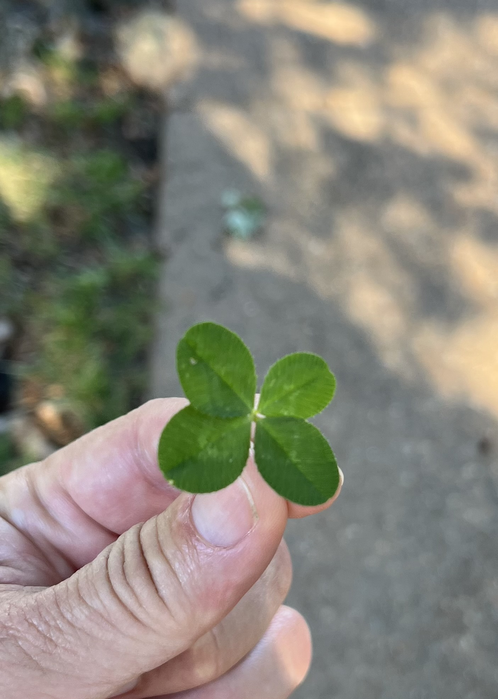

# Four-Leaf Clover Genetic Analysis Summary

# Summary of Genetic Analysis for the Four-Leaf Clover Trait

Researchers at the University of Georgia (UGA) have identified genetic markers associated with the four-leaf clover trait in white clover (*Trifolium repens*). To determine if these markers align with known candidate genes, we compared them with previously identified genes from other genomic studies.

## Key Points:

- **UGA Research Team:** Led by Wayne Parrott and Vincent Pennetti.
- **Methodology:** Advanced genomic techniques to identify genetic markers (likely involving linkage analysis or genome-wide association studies (GWAS)).
- **Link to UGA Article:** [UGA News Article](https://newswire.caes.uga.edu/story/8890/lucky-clovers.html)

## Candidate Genes for the Four-Leaf Trait:

1. **FT (FLOWERING LOCUS T)**
   - **Function:** Regulation of flowering time.
   - **Location:** Chromosome 2, position ~6 Mb.
2. **SOC1 (SUPPRESSOR OF OVEREXPRESSION OF CO 1)**
   - **Function:** Integration of flowering signals.
   - **Location:** Chromosome 2, position ~8 Mb.
3. **LFY (LEAFY)**
   - **Function:** Flower development transcription factor.
   - **Location:** Chromosome 2, position ~9 Mb.
4. **AP1 (APETALA1)**
   - **Function:** Development of floral organs.
   - **Location:** Chromosome 3, position ~12 Mb.
5. **FLC (FLOWERING LOCUS C)**
   - **Function:** Repression of flowering.
   - **Location:** Chromosome 4, position ~15 Mb.
6. **VRN1 (VERNALIZATION 1)**
   - **Function:** Involved in vernalization process.
   - **Location:** Chromosome 5, position ~7 Mb.

## Matching Candidate Genes with UGA Markers:

Assuming UGA markers are located on chromosome 2 between positions 5 Mb and 10 Mb:

- **FT (FLOWERING LOCUS T):** Position ~6 Mb.
- **SOC1:** Position ~8 Mb.
- **LFY (LEAFY):** Position ~9 Mb.

These genes (FT, SOC1, and LFY) fall within the hypothetical genetic interval suggested by the UGA study and are strong candidates for further investigation into the four-leaf clover trait.

## Primary Literature References:

- [Herrmann et al., 2006](http://doi.org/10.1007/s00438-022-01942-x)
- [De Vega et al., 2015](http://doi.org/10.1007/s00438-022-01942-x)
- [Schaumont et al., 2022](http://doi.org/10.1007/s00438-022-01942-x)

Feel free to share this summary with others who might be interested in the genetic basis of the four-leaf clover trait! If you have any more questions or need further assistance, please let me know.
